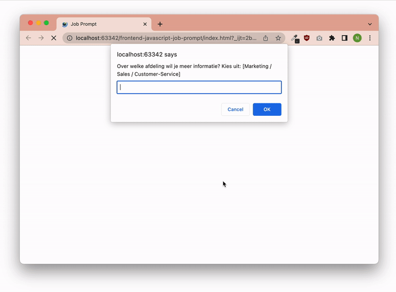

# Opdrachtbeschrijving

## Inleiding


Een grote corporate heeft jou gevraagd jou een Job Prompter te maken, gezien ze zoveel vragen krijgen over de verschillende
functies binnen hun bedrijf. _Automatiseren kun je leren!_ Om de informatie zo gericht mogelijk weer te geven, zul je
input van de gebruiker vragen om zo informatie over de juiste afdeling en functie te verschaffen. Dit doe je op basis
van de grote dataverzameling aan bedrijfsinformatie genaamd `departments` (te vinden in `main.js`).



## Voor je begint

1. Koppel het script aan de HTML-pagina door onderaan de body de volgende tag te
   plaatsen: `<script src="scripts/main.js"></script>`. Je bekijkt de console dan ook in de **browser**, niet in de terminal.
2. Voel je vrij om de dataverzameling in een los bestandje te plaatsen. Houdt er wel rekening mee dat je ieder
   afzonderlijk `.js` bestand moet koppelen via een `<script>`-tag in de HTML. Zolang je dit extra bestand aan jouw
   HTML-document linkt vóór `main.js`, kun je `departments` gewoon aanspreken.
3. Vergeet niet dat je na iedere wijziging eerst de browser even moet refreshen.

## Opdracht

### Opdracht 1 - Gegevens aanspreken

* **Opdracht 1a:** Log het aantal medewerkers van de sales-afdeling in de console, in het volgende format: *"De afdeling
  Sales heeft [x] medewerkers"*
* **Opdracht 1b:** Log de afdeling-beschrijving van de marketingafdeling in de console, in het volgende format: *"
  Marketing is een leuke afdeling om te werken. [beschrijving]."*
* **Opdracht 1c:** Log het aantal medewerkers van de customer-service-afdeling in de console, in het volgende format: *"De afdeling Customer Service heeft [aantal] medewerkers"* Let op: er is iets raars aan de hand met deze property!
* **Opdracht 1d:** Log de beschrijving van de functie "Verkoopmanager" in de console, in het volgende format: *"Sales is
  een uitdagende afdeling om te werken als Verkoopmanager. [beschrijving functie Verkoopmanager]"*

### Opdracht 2 - prompten en beslissen

Wist je dat je gebruikers om input kunt vragen vanuit de browser? Dit kun je doen met behulp van de `prompt`-methode,
kijk maar eens naar het volgende voorbeeld en probeer dit uit:

```javascript
const userInput = prompt('Hoi! Hoe heet je?');
console.log(userInput);
```

* **Opdracht 2a:** Gebruik bovenstaand voorbeeld en pas het zo aan dat de browser jou de volgende vraag
  stelt: `Over welke afdeling wil je meer informatie? Kies uit: [marketing / sales / customer-service]`. Het antwoord
  dat jij invoert, log je uiteraard in de console. *Tip*: geef jouw input-prompt altijd in kleine letters ("marketing"
  in plaats van "Marketing" of "MARKETING"), dit voorkomt problemen in het script.

* **Opdracht 2b:** tijd voor het echte werk! Op basis van wat de gebruiker invoert ("marketing", "sales" of "customer
  service") willen wij een beschrijving van die afdeling in de console loggen. Hiervoor typ je natuurlijk niet handmatig de beschrijvingen over! Je spreekt ze aan via het `departments`-object: hiervoor zul je dus een *beslissingsstructuur* moeten bouwen. Ongeacht de gekozen afdeling, log je de uitkomst in het volgende format: 
  *"Je koos [ingevoerde keuze]. [beschrijving afdeling]"*
  
* **Opdracht 2c:** test of alles werkt door alle mogelijke afdelingen een keertje te voeren en te checken of je de
  gewenste output krijgt. Maak jouw beslisboom nu extra gebruiksvriendelijk door de melding *"Ongeldige keuze. Probeer
  het opnieuw door de pagina te verversen."* in de console te laten zien wanneer de gebruiker een spelfout maakt of iets
  verkeerds invoert. *Tip:* je kunt hiervoor `console.error()` gebruiken in plaats van `console.log()`.

### Opdracht 3 - een nieuwe prompt

Ons script begint al behoorlijk vorm te krijgen! Echter, om de volgende opdrachten te kunnen maken, is het belangrijk
dat je jouw prompt én beslisboom even [uit-comment](https://nl.wikipedia.org/wiki/Uitcommentari%C3%ABren). Geen zorgen,
we hebben deze code straks weer nodig, maar we gaan ons nu even richten op het perfectioneren van een nieuwe prompt.

* **Opdracht 3a:** We gaan er voor nu even vanuit dat de gebruiker de afdeling 'marketing' heeft gekozen. Schrijf een
  nieuwe prompt die de gebruiker om het volgende vraagt:

  ```shell
  Je koos marketing. Over welke functie wil je meer weten? Voer een getal tussen 0 en 3 in.
  0: [functietitel marketing 0],
  1: [functietitel marketing 1],
  2: [functietitel marketing 2],
  3: [functietitel marketing 3]
  ```

  Hierbij typ je de functietitels van Marketing niet handmatig over, maar spreek je ze aan via de `marketing`-property in het `departments`-object.

* **Opdracht 3b:** Op basis van wat de gebruiker invoert (`0`, `1`, `2`, of `3`) willen wij de beschrijving van de bijbehorende
  marketing-functie-titel en marketing-functie-beschrijving in de console loggen. Dit doe je in het volgende format:
 
  *"Je koos [titel ingevoerde marketing functie]. Een uitdagende rol! [beschrijving ingevoerde marketing functie]"*

  Hiervoor zul je dus een beslissingsstructuur moeten bouwen. *Tip:* houdt er rekening mee dat ondanks dat de gebruiker een getal invoert, dit vanuit een prompt altijd terugkomt als de string-versie van dat getal. `3` is namelijk iets anders dan `"3"`

* **Opdracht 3c:** test of alles werkt door alle mogelijke getallen een keertje te voeren in de prompt en te checken of
  je de gewenste output krijgt. Maak jouw beslisboom nu extra gebruiksvriendelijk door de melding *"Ongeldige keuze.
  Probeer het opnieuw door de pagina te verversen."* in de console te laten zien wanneer de gebruiker iets anders
  invoert dan 0 - 3.

### Opdracht 4 - samenvoegen

Je hebt nu alle logica geschreven op basis van de afdeling Marketing. Leuk, maar het is de bedoeling dat de afdeling die
we gebruiken in de tweede prompt afkomstig is van de input uit de *eerste* prompt. We moeten de letterlijke `marketing`
uit opdracht 3 dus gaan vervangen door de *input* uit opdracht 2...

* **Opdracht 4a:** Zet alle code uit opdracht 2 weer aan. Comment de code uit opdracht 3 uit. Log de
  afdeling-beschrijving van de ingevoerde afdeling uit de eerste prompt in de console, in het volgende format:
  *"[afdeling-naam] is een leuke afdeling om te werken. Er werken op dit moment [aantal] medewerkers."*
  Tip: gebruik hiervoor de blokhaak notatie.
  Bekijk [hier](https://bobbyhadz.com/blog/javascript-get-object-value-by-variable-key) een voorbeeld van het gebruik
  van een variabele als object-key.

* **Opdracht 4b:** We gaan de prompt uit opdracht 3 omschrijven. In plaats van overal hardcoded de afdeling 'marketing'
  te gebruiken, zorg je dat de prompt de informatie toont op basis van ingevoerde afdeling door de gebruiker:

  `Je koos [afdeling]. Over welke functie wil je meer weten? Voer een getal tussen 0 en 3 in. `
  `[0: [functietitel afdeling x], `
  `1: [functietitel afdeling x],  `
  `2: [functietitel afdeling x], `
  `3: [functietitel afdeling x]`

* **Opdracht 4c:** Doe dit vervolgens ook voor de beslisboom. In plaats van overal hardcoded de afdeling 'marketing' te gebruiken, zorg je dat de afdeling-naam gebruikt wordt die de gebruiker heeft ingevoerd. Dus als de gebruiker eerst 'sales' koos en daarna '2', krijgt de gebruiker informatie over de functie Verkoopmanager te zien.


### Opdracht 5 - bonus

Alles in de console loggen is leuk, maar een 'normale' gebruiker zal er niet aan denken om deze te openen. De webpagina
blijft namelijk gewoon leeg... Daar kunnen we echter wel iets aan doen!

Je hebt nog niet geleerd hoe je informatie uit een script op de pagina kunt tonen, maar je komt waarschijnlijk een heel
eind met het volgende voorbeeld. Kijk maar eens wat er gebeurt als je deze code onderaan jouw script toevoegt. *Let op:*
je zult eerst de prompt's moeten invullen voor je de pagina te zien krijgt.

```javascript
document.getElementById('role-title').textContent = 'banaan!';
```

De reden dat dit stukje code werkt, komt omdat er in `index.html` een lege `<h1>`-tag staat met de `id="role-title"`.
Door elementen in `index.html` middels hun id-attribuut aan te spreken, kunnen we de inhoud van de tekst aanpassen! Ga
maar eens kijken in `index.html`: hierin zie je in totaal vier lege elementen staan...

* **Opdacht 5a:** Maak gebruik van het bovenstaande voorbeeld om ervoor te zorgen dat jouw naam in de titel op de pagina
  komt te staan. En nu je toch bezig bent kun je ook eens proberen één van de andere tags te vullen met jouw
  lievelingseten. Lukt dat? Comment het dan weer uit, want je zult het op een andere manier gaan toepassen.

* **Opdracht 5b:** Voeg op alle plekken waar je console.log's hebt gebruikt deze statements toe om output weer te geven in de juiste elementen. Indien de gebruiker "marketing" en "0" heeft ingevoerd, wordt het volgende weergegeven op de pagina:

```html

<h2 id="role-title">Marketingmanager</h1>
    <p id="department-description">Marketing omvat verschillende strategieën en activiteiten gericht op het promoten van
        producten, diensten of merken bij het doelpubliek. Het omvat het begrijpen van de behoeften en voorkeuren van
        consumenten, het uitvoeren van marktonderzoek, het ontwikkelen van marketingplannen en het implementeren van
        tactieken om potentiële klanten te bereiken en te betrekken. Marketingprofessionals analyseren markttrends,
        identificeren doelmarkten en creëren overtuigende boodschappen en communicatiestrategieën om merkbekendheid op
        te bouwen, klantenwerving te stimuleren en klantloyaliteit te bevorderen.</p>
    <p id="role-description">De marketingmanager is verantwoordelijk voor het ontwikkelen en implementeren van
        marketingstrategieën om de producten of diensten van een bedrijf te promoten. Ze houden toezicht op
        marktonderzoek, reclamecampagnes en initiatieven voor klantenwerving. Ze analyseren markttrends, identificeren
        doelgroepen en werken samen met interdisciplinaire teams om marketingdoelen te bereiken en bedrijfsgroei te
        stimuleren.</p>
    <span id="error-message"></span>
```

Indien de invoer niet klopt, wordt de foutmelding weergegeven:

```html
<span id="error-message">Ongeldige keuze. Probeer het opnieuw door de pagina te verversen.</span>
```

* **Opdracht 5c:** Waarschijnlijk heb je alle zinnen aan elkaar geplakt met behulp van `+`. Maar als we lange zinnen
  maken met veel variabelen erin, vergeten we al snel ergens een spatie en wordt het een onoverzichtelijk zooitje. Je
  kunt daarom
  ook [Template literals](https://www.digitalocean.com/community/tutorials/understanding-template-literals-in-javascript#expression-interpolation)
  gebruiken!
